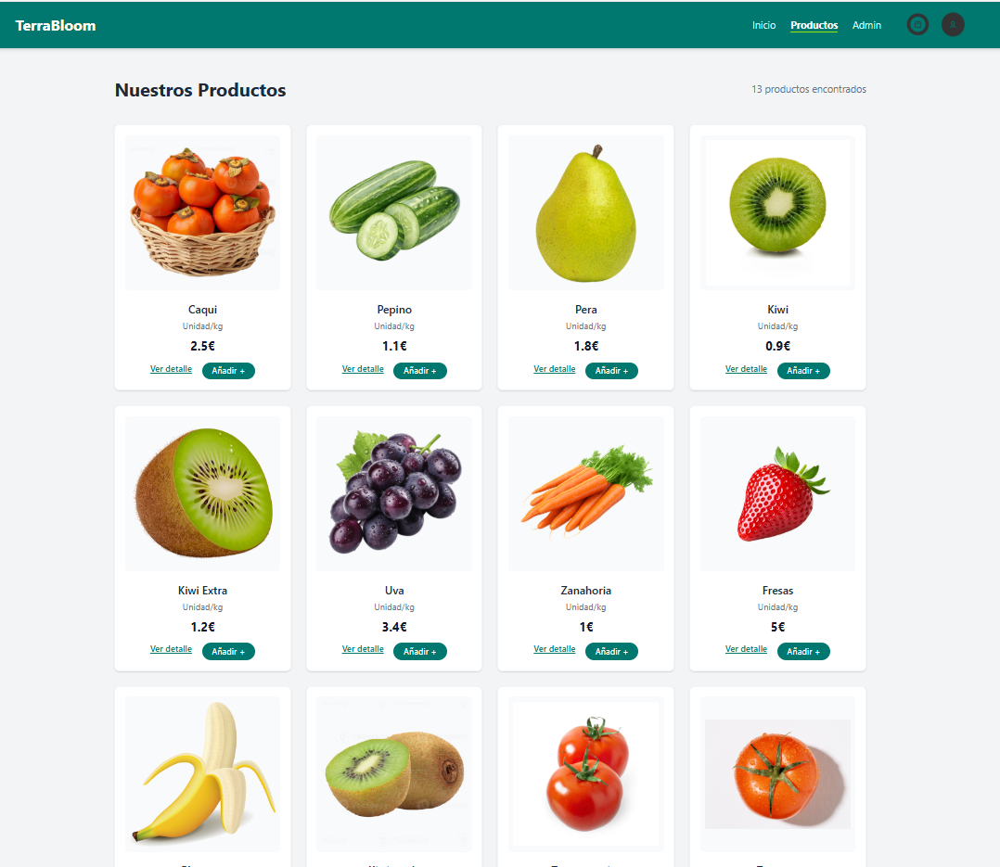
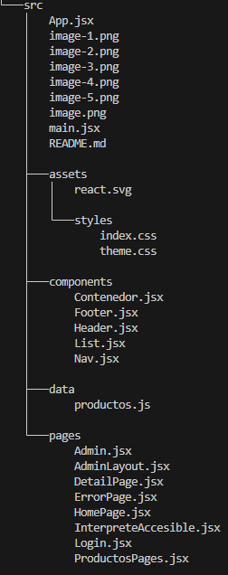
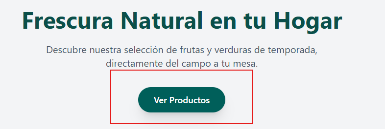
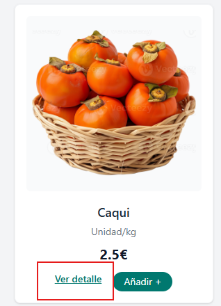
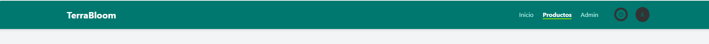
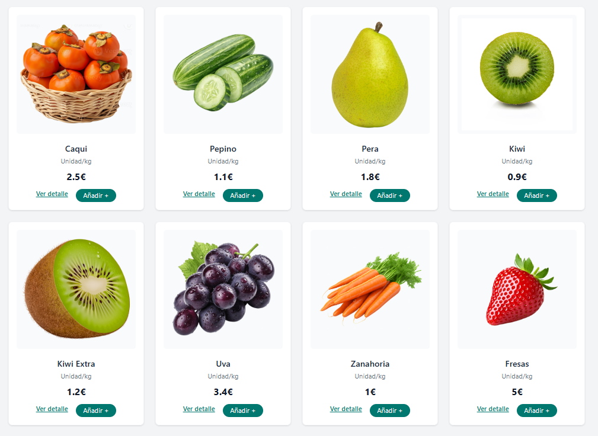
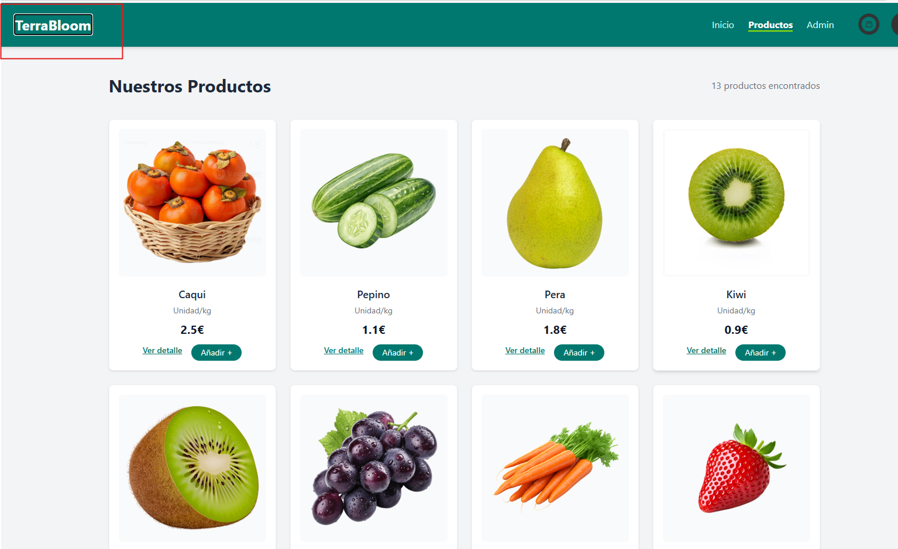
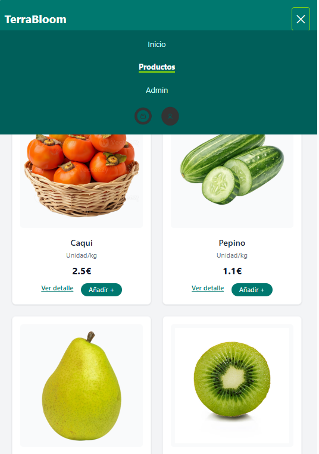

#  Documentación  y Explicación

**Autor:** AbdelMoghit Samini  
**Práctica:** Desarrollo de Interfaces (UT03)  

## 1.Generación y adaptación de interfaces

### a. Personalización de propiedades
He modificado completamente estilos, tipografías, colores, espaciados y distribución de elementos utilizando TailwindCSS.
La interfaz sigue fielmente mi diseño base y mantiene coherencia visual en todas las páginas.

### b. Análisis y modificación del código
He revisado y adaptado el código generado, ajustando clases, jerarquías y contenedores para que todo quede limpio, coherente y fácil de mantener.  
La maquetación de `List.jsx` y otros componentes está optimizada, ordenada y lista para reutilizar en cualquier parte de la aplicación.

### c. Aplicación funcional

## 2. Creación de componentes

Organización de proyecto

###  Propiedades, eventos y acciones
Los componentes manejan props, rutas dinámicas y eventos como:

- clic en productos
a-pertura/cierre del menú responsivo
- navegación hacia detalles
- botón volver atrás

Esto garantiza una interacción natural y fluida.

###  Documentación de componentes
Estan los componentes documentados con JavaDoc

## 3. Usabilidad y accesibilidad
### a. Distribución y adecuación de elementos
He estructurado cada vista respetando jerarquía visual:

- Cabecera fija
- Navegación clara

- Productos alineados en grid responsivo
- Botones y acciones distribuídos de forma coherente

## b. Accesibilidad básica
He aplicado varios principios de accesibilidad, como:

- colores con contraste legible
- navegación por teclado con focus visible
- etiquetas alt descriptivas en imágenes
- atributos WAI-ARIA en el menú móvil
- roles semánticos (header, nav, main, footer)
- controles grandes y fácilmente seleccionables en móvil

La aplicación es usable por teclado y lectores de pantalla.

## c. Pruebas de usabilidad

Tanto en móvil como en escritorio puedes navegar con solo el teclado TAB, tambien el menu de hamburguesa se aprece segun el tamaño de pantalla.

